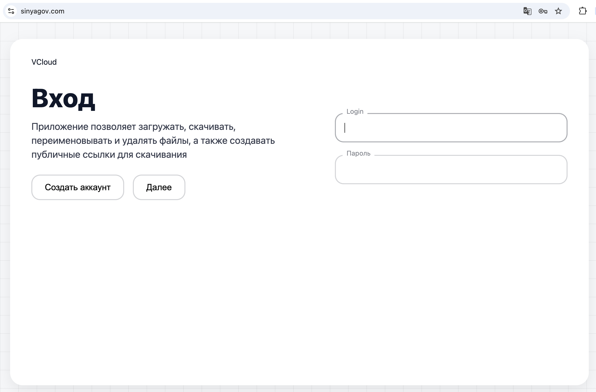
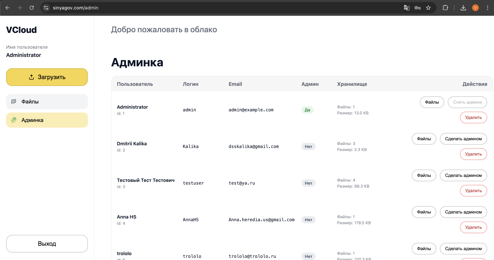
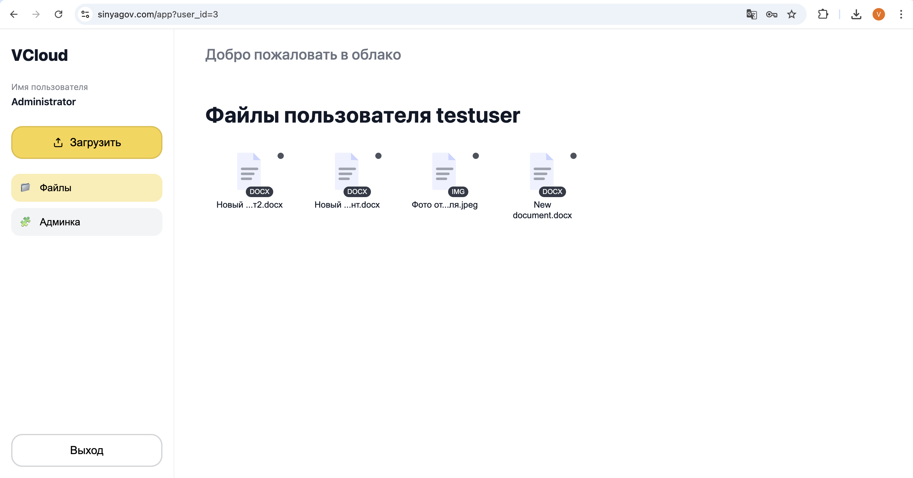
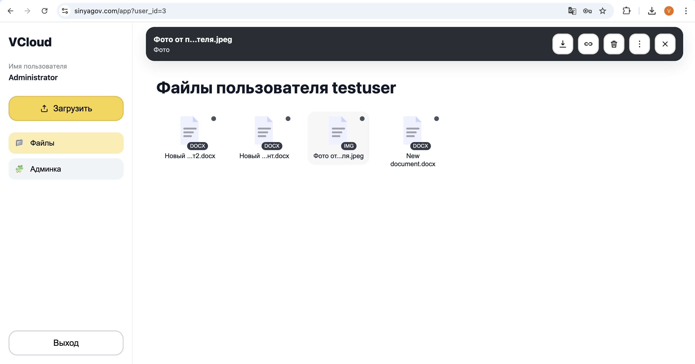
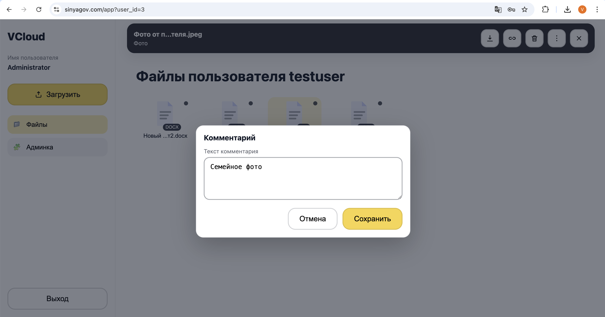
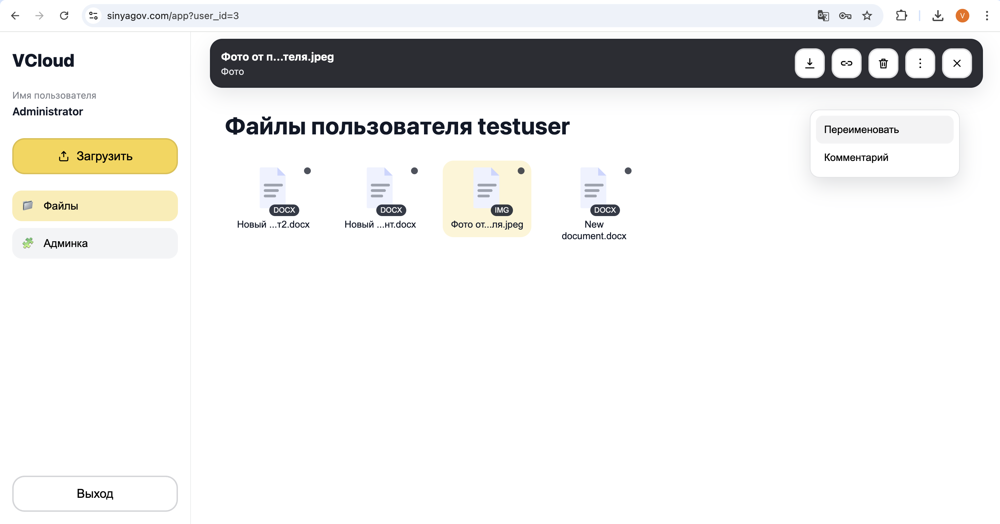
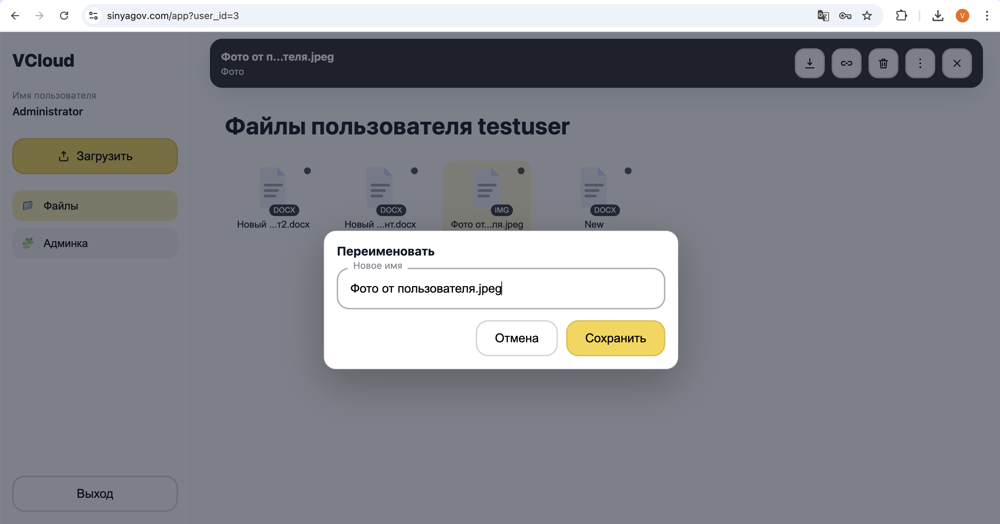
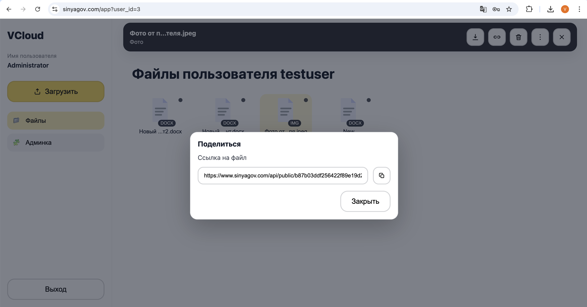

# VCloud Storage

Проект: **облачное хранилище файлов** с backend на Django (REST API) и frontend на React.

Проект состоит из двух независимых частей:
- **Backend** — API, авторизация, работа с файлами и пользователями
- **Frontend** — пользовательский интерфейс


## 🖥️ Визуализация реализованного UI:

<details>
<summary><strong>👁️ Посмотреть</strong></summary>

















---
</details>

## 📁 Структура проекта
```
VCloud/
backend/    # Django + DRF
frontend/   # React + Webpack
```

---

<details>
<summary><strong>🛠️ Технологии</strong></summary>

### Backend
- Python 3.10+
- Django 4.2
- Django REST Framework
- PostgreSQL
- Session-based authentication (cookies)
- django-cors-headers

### Frontend
- Node.js **>= 20**
- React **>= 18**
- Webpack **>= 5**
- Redux Toolkit
- React Router

---
</details>

## 🔧 Backend

### Описание

Backend реализует REST API для:
- регистрации и авторизации пользователей
- управления файлами
- администрирования пользователей

Используется кастомная модель пользователя с логином вместо username.

---

<details>
<summary><strong>🛠️ Описание структуры папок и файлов backend </strong></summary>

#### `backend/manage.py`
Стандартная точка входа Django:
- запуск сервера `python manage.py runserver`
- миграции `python manage.py migrate`

#### `backend/requirements.txt`
Список Python-зависимостей проекта (Django, DRF, dotenv и др.).
Используется для установки окружения:
`pip install -r requirements.txt`

---

### Django apps

#### `backend/cloud_storage/` - корневой Django-проект
Основная конфигурация Django:

- `urls.py` - маршрутизация проекта:
  - `api/auth/` → `accounts.urls`
  - `api/` → `storage.urls`
  - SPA fallback: все пути кроме `api/` и `admin/` отдают `templates/index.html`
- `settings.py` - настройки Django (DRF, CORS, статика, медиа и т.д.)
- `wsgi.py/asgi.py` - точки входа для деплоя (WSGI/ASGI)

#### `backend/accounts/` - пользователи и аутентификация
Отвечает за:
- регистрацию
- логин/логаут (сессионная авторизация)
- `me` (текущий пользователь)
- админские методы для управления пользователями (список/удаление/назначение админа)

Файлы:
- `models.py` - модель пользователя (`User`)
- `serializers.py` - сериализация пользователя для API
- `views.py` - API-методы для работы с пользователями (register/login/logout/me/users…)
- `urls.py` - роуты `api/auth/*`
- `permissions.py` - права доступа `IsAdmin`

#### `backend/storage/` - файловое хранилище (основная бизнес-логика)
Отвечает за:
- загрузку файлов
- получение списка файлов (включая админский просмотр чужого хранилища по параметру `user_id`)
- скачивание
- удаление
- переименование
- комментарии
- публичные ссылки (public link)

Файлы:
- `models.py` - модель `StoredFile` (метаданные файла, владелец, путь, размер, comment, public_token)
- `views.py` - API-методы для работы с файлами
- `urls.py` - роуты `api/*` для файлов
- `services.py` - сервисный слой, отвечающий за формирование путей и имён файлов на диске

---

#### Статика и шаблоны

#### `backend/templates/`
Шаблоны Django. В проекте используется для SPA-fallback:
- `index.html` - основной HTML, в который подставляется собранный React (build)

#### `backend/static/`
Статические файлы Django - в продакшене сюда собираются/копируются статика и ассеты.

---

#### Данные файлового хранилища на диске

#### `media/storage/`
Физическое хранилище файлов на сервере/локально.
Файлы сохраняются под уникальными именами и раскладываются по папкам пользователей (`storage_path`), а в БД хранится:
- оригинальное имя
- уникальное имя на диске
- относительный путь (`relative_path`)
- размер
- комментарий
- публичный токен (для публичной ссылки)

---
</details>

<details>

<summary><strong>🔌 API эндпоинты</strong></summary>

Backend предоставляет REST API для аутентификации, управления пользователями
и работы с файловым хранилищем.

---

#### Аутентификация и пользователи 

- `GET /api/auth/csrf`  
  Получение CSRF-cookie для фронтенда.

- `POST /api/auth/register`  
  Регистрация нового пользователя.

- `POST /api/auth/login`  
  Аутентификация пользователя.

- `POST /api/auth/logout`  
  Выход из системы.

- `GET /api/auth/me`  
  Получение данных текущего пользователя.

---

#### Администрирование пользователей (только администратор)

- `GET /api/auth/users`  
  Получение списка пользователей.  
  В ответе дополнительно возвращается информация о файловом хранилище пользователя:
  - количество файлов
  - суммарный размер файлов
  - форматированный размер (KB / MB / GB)

- `DELETE /api/auth/users/{id}`  
  Удаление пользователя.

- `PATCH /api/auth/users/{id}/admin`  
  Назначение или снятие прав администратора.

---

#### Работа с файлами

- `GET /api/files`  
  Получение списка файлов текущего пользователя.

- `GET /api/files?user_id={id}`  
  Получение списка файлов указанного пользователя  
  (доступно только администратору).

- `POST /api/files/upload`  
  Загрузка нового файла.

- `DELETE /api/files/{id}`  
  Удаление файла.

- `PATCH /api/files/{id}/rename`  
  Переименование файла.

- `PATCH /api/files/{id}/comment`  
  Обновление комментария к файлу.

- `GET /api/files/{id}/download`  
  Скачивание файла.

- `GET /api/files/{id}/public-link`  
  Генерация или получение публичной ссылки на файл.

---

#### Публичный доступ к файлам

- `GET /api/public/{token}/download`  
  Скачивание файла по публичной ссылке без авторизации.
---

</details>

## 🎨 Frontend

Frontend - SPA-приложение на React, взаимодействующее с backend API.

Реализовано:
- регистрация и вход
- работа с файлами
- роли пользователей (user / admin)
- админ-панель для управления пользователями

<details>
<summary><strong>🛠️ Описание структуры папок и файлов frontend </strong></summary>

```text
frontend/
├─ package.json              # зависимости, скрипты (start/build/test)
├─ package-lock.json         # lock-файл npm
├─ webpack.config.js         # конфигурация сборки Webpack (JS/JSX, CSS Modules, devServer)
├─ index.html                # HTML-шаблон для SPA (root контейнер)
├─ eslint.config.js          # ESLint конфиг проекта
├─ node_modules/             # зависимости (не коммитятся)
└─ src/
   ├─ main.jsx               # точка входа: ReactDOM + Provider (Redux) + BrowserRouter
   ├─ styles.css             # глобальные стили и CSS-переменные (:root), базовые reset-правила
   ├─ app/
   │  ├─ App.jsx             # маршрутизация (Routes): /, /register, /app, /admin
   │  ├─ store.js            # конфигурация Redux store
   │  └─ api.js              # HTTP-клиент/обертка для запросов к backend API
   ├─ features/
   │  ├─ auth/               # Redux-слайс авторизации
   │  │  └─ authSlice.js     # initAuth, login/logout, user state
   │  ├─ files/              # Redux-слайс файлов
   │  │  └─ filesSlice.js    # fetchFiles, delete/rename/comment, getPublicLink
   │  └─ users/              # Redux-слайс админки
   │     └─ usersSlice.js    # fetchUsers, deleteUser, setAdmin
   ├─ pages/
   │  ├─ AuthPage.jsx         # страница входа
   │  ├─ AuthPage.module.css  # css-модуль для страницы входа   
   │  ├─ Register.jsx         # страница регистрации
   │  ├─ Register.module.css  # css-модуль для страницы регистрации   
   │  ├─ FilesPage.jsx        # страница файлов (основной интерфейс)
   │  ├─ FilesPage.module.css # css-модуль для страницы с файлами   
   │  └─ AdminPage.jsx        # админка (список пользователей + переход к их файлам)
   │  ├─ AdminPage.module.css # css-модуль для админки
   ├─ components/
   │  ├─ layout/
   │  │  └─ AppLayout.jsx         # общий layout: сайдбар + основная область контента
   │  │  └─ AppLayout.module.css  # css-модуль для layout
   │  │  └─ AuthLayout.jsx        # layout для страниц авторизации и регистрации (общая обёртка)
   │  │  └─ AuthLayout.module.css # css-модуль для layout
   │  │  └─ Logo.jsx              # UI-компонент для отображения логотипа приложения            
   │  ├─ sidebar/
   │  │  └─ Sidebar.jsx        # боковое меню, кнопка Upload, навигация Files/Admin/Logout
   │  │  └─ Sidebar.module.css # css-модуль для бокового меню  
   │  ├─ files/
   │  │  ├─ FileGrid.jsx          # сетка карточек файлов
   │  │  ├─ FileGrid.module.css   # css-модуль для сетки карточек файлов   
   │  │  ├─ FileCard.jsx          # карточка файла (иконка + имя + индикаторы)
   │  │  ├─ FileCard.module.css   # css-модуль для карточки файла   
   │  │  ├─ FileTopBar.jsx        # верхняя панель выбранного файла (download/share/delete/menu/close)
   │  │  ├─ FileTopBar.module.css # css-модуль для TopBar
   │  │  └─ FileMenu.jsx          # выпадающее меню (rename/comment)
   │  │  ├─ FileMenu.module.css   # css-модуль для выпадающего меню
   │  ├─ modals/
   │  │  ├─ ShareModal.jsx    # модалка «Поделиться» (ссылка + кнопка копирования)
   │  │  ├─ DeleteModal.jsx   # подтверждение удаления
   │  │  ├─ RenameModal.jsx   # переименование
   │  │  └─ CommentModal.jsx  # редактирование комментария
   │  └─ ui/
   │     ├─ Button.jsx        # UI-кнопка (варианты: ghost/danger/primary и т.д.)
   │     ├─ Button.module.css # css-модуль для кнопки (варианты: ghost/danger/primary и т.д.)   
   │     ├─ Modal.jsx         # базовый компонент модального окна
   │     ├─ Modal.module.css  # css-модуль для модального окна
   │     ├─ Input.jsx         # UI-поля ввода (варианты: label, value и обработчиков событий и т.д.)
   │     ├─ Input.module.css  # css-модуль для поля ввода        
   │     └─ icons.jsx         # набор SVG-иконок (upload, download, copy, close, ...)
   └─ utils/
      └─ text.js              # утилиты (например, truncateMiddle для обрезки длинных строк)
```

</details>


## 🚀 Инструкция по настройке и деплою проекта VCloud (Linux)

<details>
<summary><strong>⚙️ Показать инструкцию</strong></summary>

1. Подключение к серверу
``` 
ssh root@91.197.98.216 
password
```

2. Установка системных зависимостей

Обновление пакетов и установка базовых инструментов:
``` 
apt update
apt install -y \
  python3-venv \
  python3-pip \
  nginx \
  git \
  curl \
  nodejs \
  npm \
  build-essential 
  ```

Проверка nginx:
``` systemctl status nginx ```

3. Клонирование проекта
``` 
mkdir -p /var/www
cd /var/www
git clone https://github.com/VikiKuk/VCloud.git
cd VCloud
```

4. Настройка backend (Django)

4.1 Виртуальное окружение и зависимости
``` 
cd backend
python3 -m venv venv
source venv/bin/activate
pip install --upgrade pip
pip install -r requirements.txt
```

4.2 Создание .env
```nano backend/.env```

Пример содержимого:
``` 
DJANGO_DEBUG=0
DJANGO_ALLOWED_HOSTS=91.197.98.216,localhost,127.0.0.1
DJANGO_SECRET_KEY=YOUR_SECRET_KEY

DB_NAME=cloud_storage
DB_USER=cloud_user
DB_PASSWORD=YOUR_DB_PASSWORD
DB_HOST=127.0.0.1
DB_PORT=5432

FILES_BASE_DIR=media/storage
```

Генерация секретного ключа:
```python3 -c "import secrets; print(secrets.token_urlsafe(50))"```

5. База данных (PostgreSQL)

```
apt install -y postgresql postgresql-contrib
systemctl enable --now postgresql
```
Проверка:

``` systemctl status postgresql --no-pager```

Создание базы и пользователя:
```
sudo -u postgres psql -c "CREATE DATABASE cloud_storage;"
sudo -u postgres psql -c "CREATE USER cloud_user WITH PASSWORD 'cloud_pass';"
sudo -u postgres psql -c "GRANT ALL PRIVILEGES ON DATABASE cloud_storage TO cloud_user;"
```

Права на schema:
```
sudo -u postgres psql -d cloud_storage -c "GRANT ALL ON SCHEMA public TO cloud_user;"
sudo -u postgres psql -d cloud_storage -c "ALTER SCHEMA public OWNER TO cloud_user;"
```

При необходимости:
```
sudo -u postgres psql -d cloud_storage -c "GRANT ALL PRIVILEGES ON ALL TABLES IN SCHEMA public TO cloud_user;"
sudo -u postgres psql -d cloud_storage -c "GRANT ALL PRIVILEGES ON ALL SEQUENCES IN SCHEMA public TO cloud_user;"
```

6. Миграции и статика

```python manage.py migrate```

```
mkdir -p static
python manage.py collectstatic --noinput
```

7. Проверка запуска Django

```python manage.py runserver 0.0.0.0:8000```

8. Gunicorn как systemd-сервис

```pip install gunicorn```

Создание сервиса:
```nano /etc/systemd/system/vcloud-gunicorn.service```

Записать в файл:
```
[Unit]
Description=VCloud Django (gunicorn)
After=network.target

[Service]
User=root
Group=www-data
WorkingDirectory=/var/www/VCloud/backend
EnvironmentFile=/var/www/VCloud/backend/.env
ExecStart=/var/www/VCloud/backend/venv/bin/gunicorn cloud_storage.wsgi:application --bind 127.0.0.1:8000 --workers 2 --timeout 60
Restart=always

[Install]
WantedBy=multi-user.target
```

Запуск:
```
systemctl daemon-reload
systemctl enable --now vcloud-gunicorn
```

9. Сборка frontend (React)

```
cd frontend
npm ci
npm run build
```

10. Настройка nginx

```nano /etc/nginx/sites-available/vcloud```

Записать в файл:
```
server {
  listen 80;
  server_name YOUR_NAME_SERVER;

  # React (webpack output)
  root /var/www/VCloud/backend/static/frontend;
  index index.html;

  location / {
    try_files $uri /index.html;
  }

  # Django API
  location /api/ {
    proxy_pass http://127.0.0.1:8000;
    proxy_set_header Host $host;
    proxy_set_header X-Real-IP $remote_addr;
    proxy_set_header X-Forwarded-For $proxy_add_x_forwarded_for;
    proxy_set_header X-Forwarded-Proto $scheme;
  }

  # Uploaded files
  location /media/ {
    alias /var/www/VCloud/backend/media/;
  }

  # Django collected static (admin, etc.)
  location /staticfiles/ {
    alias /var/www/VCloud/backend/staticfiles/;
  }
}
```

Активация:
```
ln -sf /etc/nginx/sites-available/vcloud /etc/nginx/sites-enabled/
rm -f /etc/nginx/sites-enabled/default
nginx -t
systemctl reload nginx
```

11. Проверка

В браузере: http://91.197.98.216/

API: curl http://91.197.98.216/api/auth/me

---
</details>
